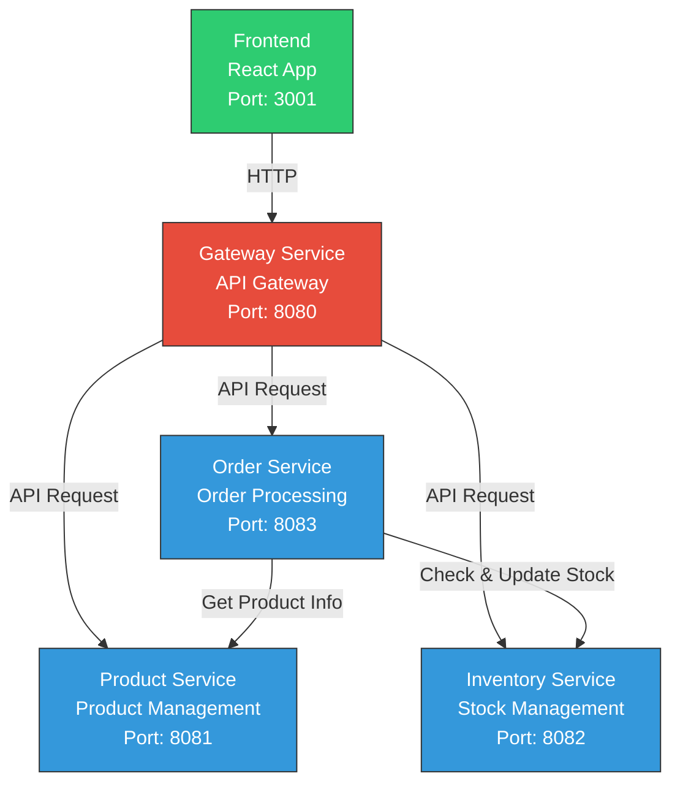
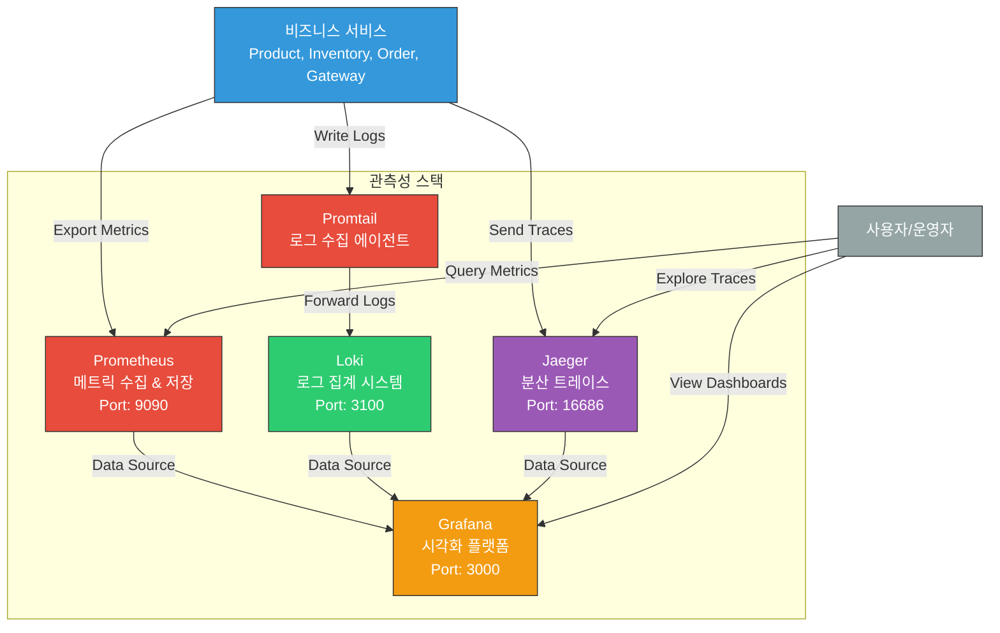

# 마이크로서비스 아키텍처에서의 관측성 구현 가이드

## 1. 소개

이 문서는 마이크로서비스 아키텍처(MSA)에서 효과적인 관측성(Observability) 시스템을 구축하기 위한 가이드입니다. Hello Observability 프로젝트를 통해 관측성의 세 가지 핵심 요소(메트릭, 로그, 트레이스)를 구현하고 통합하는 방법을 설명합니다.

### 1.1 관측성이란?

관측성(Observability)은 시스템의 외부 출력을 통해 내부 상태를 이해하는 능력을 의미합니다. 관측성의 세 가지 핵심 요소는 다음과 같습니다:

- **메트릭(Metrics)**: 시스템 성능과 동작에 대한 수치적 측정값
- **로그(Logs)**: 시스템 내에서 발생하는 이벤트의 텍스트 기록
- **트레이스(Traces)**: 분산 시스템에서 요청의 전체 경로를 추적하는 데이터

### 1.2 마이크로서비스 아키텍처와 관측성의 중요성

마이크로서비스 아키텍처에서는 여러 서비스가 독립적으로 배포되고 운영되기 때문에 전통적인 모놀리식 애플리케이션보다 시스템을 이해하고 문제를 해결하는 것이 더 복잡합니다. 관측성은 이러한 복잡성을 관리하는 핵심 도구입니다.

## 2. Hello Observability 아키텍처 개요

Hello Observability 프로젝트는 전자상거래 도메인을 간소화한 마이크로서비스 아키텍처를 구현합니다. 이 아키텍처는 다음과 같은 구성 요소로 이루어져 있습니다:

### 2.1 비즈니스 서비스



- **Product Service**: 제품 정보 관리 (포트: 8081)
- **Inventory Service**: 재고 관리 (포트: 8082)
- **Order Service**: 주문 처리 (포트: 8083)
- **Gateway Service**: API 게이트웨이 (포트: 8080)
- **Frontend**: React 기반 사용자 인터페이스 (포트: 3001)

### 2.2 관측성 스택



- **Prometheus**: 메트릭 수집 및 저장 (포트: 9090)
- **Loki**: 로그 집계 시스템 (포트: 3100)
- **Jaeger**: 분산 트레이스 수집 및 시각화 (포트: 16686)
- **Grafana**: 통합 데이터 시각화 플랫폼 (포트: 3000)
- **Promtail**: 로그 수집 에이전트

## 3. 관측성 구현 상세

### 3.1 메트릭 구현 (Metrics)

메트릭은 시스템의 상태와 성능을 수치적으로 측정한 값입니다. Hello Observability에서는 Prometheus를 통해 메트릭을 수집하고 저장합니다.

#### 3.1.1 Prometheus 설정

**prometheus.yml**:
```yaml
global:
  scrape_interval: 15s

scrape_configs:
  - job_name: 'prometheus'
    static_configs:
      - targets: ['localhost:9090']

  - job_name: 'product-service'
    metrics_path: '/actuator/prometheus'
    static_configs:
      - targets: ['product-service:8081']

  # ... 다른 서비스 스크래핑 설정 ...
```

#### 3.1.2 애플리케이션 메트릭 노출

각 서비스는 `prometheus-flask-exporter`를 사용하여 메트릭을 노출합니다:

```python
from prometheus_flask_exporter import PrometheusMetrics

app = Flask(__name__)
metrics = PrometheusMetrics(app)
metrics.info('app_info', 'Product Service', version='1.0.0')
```

#### 3.1.3 주요 수집 메트릭

- **HTTP 요청 수**: `http_server_requests_seconds_count`
- **응답 시간**: `http_server_requests_seconds_sum`
- **오류율**: 상태 코드별 요청 수
- **시스템 자원 사용량**: CPU, 메모리, 디스크 I/O 등

### 3.2 로그 구현 (Logs)

로그는 시스템 내에서 발생하는 이벤트의 텍스트 기록입니다. Hello Observability에서는 Loki를 통해 로그를 집계하고 검색합니다.

#### 3.2.1 Loki 및 Promtail 설정

**loki-config.yml**:
```yaml
auth_enabled: false

server:
  http_listen_port: 3100

# ... 생략 ...

limits_config:
  reject_old_samples: true
  reject_old_samples_max_age: 168h
  allow_structured_metadata: false
```

**promtail-config.yml**:
```yaml
server:
  http_listen_port: 9080
  grpc_listen_port: 0

# ... 생략 ...

scrape_configs:
  - job_name: system
    static_configs:
      - targets:
          - localhost
        labels:
          job: varlogs
          __path__: /var/log/*log
```

#### 3.2.2 구조화된 로깅 구현

각 서비스는 Python의 기본 로깅 모듈을 사용하여 구조화된 로그를 생성합니다:

```python
logging.basicConfig(
    level=logging.INFO,
    format='%(asctime)s [%(levelname)s] %(message)s',
    handlers=[
        logging.StreamHandler()
    ]
)
logger = logging.getLogger(__name__)

# 로그 사용 예
logger.info(f"Created new order: {order_id}")
```

#### 3.2.3 주요 로그 패턴

- **정보 로그**: 일반 작업 흐름 추적
- **경고 로그**: 잠재적 문제 (예: 재고 부족)
- **오류 로그**: 실패한 작업과 예외
- **요청/응답 로깅**: API 호출의 입력 및 출력

### 3.3 트레이스 구현 (Traces)

트레이스는 분산 시스템에서 요청의 전체 경로를 추적하는 데이터입니다. Hello Observability에서는 OpenTelemetry와 Jaeger를 통해 분산 트레이싱을 구현합니다.

#### 3.3.1 Jaeger 설정

Jaeger는 Docker Compose에서 다음과 같이 설정됩니다:

```yaml
jaeger:
  image: jaegertracing/all-in-one:latest
  ports:
    - "16686:16686"  # UI
    - "14268:14268"  # HTTP
    - "6831:6831/udp"  # Agent
  networks:
    - observability-net
```

#### 3.3.2 OpenTelemetry 구현

각 서비스는 OpenTelemetry를 사용하여 트레이스를 생성하고 전파합니다:

```python
# OpenTelemetry 설정
resource = Resource(attributes={
    SERVICE_NAME: "order-service"
})

trace.set_tracer_provider(TracerProvider(resource=resource))
jaeger_exporter = JaegerExporter(
    agent_host_name=os.getenv("JAEGER_HOST", "jaeger"),
    agent_port=int(os.getenv("JAEGER_PORT", "6831")),
)
trace.get_tracer_provider().add_span_processor(
    BatchSpanProcessor(jaeger_exporter)
)

# Flask와 Requests 계측
FlaskInstrumentor().instrument_app(app)
RequestsInstrumentor().instrument()

# 수동 스팬 생성
@app.route('/orders', methods=['POST'])
def create_order():
    tracer = trace.get_tracer(__name__)
    with tracer.start_as_current_span("create_order") as span:
        # ... 비즈니스 로직 ...
```

#### 3.3.3 트레이스 흐름 예시

주문 생성 과정의 트레이스 흐름:

1. Frontend → Gateway Service
2. Gateway Service → Order Service
3. Order Service → Product Service (제품 정보 조회)
4. Order Service → Inventory Service (재고 확인)
5. Order Service → Inventory Service (재고 업데이트)

이 전체 흐름은 Jaeger UI에서 단일 트레이스로 시각화됩니다.

### 3.4 통합 대시보드 (Grafana)

Grafana는 모든 관측성 데이터를 통합하여 시각화하는 역할을 합니다.

#### 3.4.1 데이터 소스 설정

**datasources.yaml**:
```yaml
apiVersion: 1

datasources:
  - name: Prometheus
    type: prometheus
    access: proxy
    url: http://prometheus:9090
    isDefault: true
    version: 1
    editable: true

  - name: Loki
    type: loki
    access: proxy
    url: http://loki:3100
    version: 1
    editable: true

  - name: Jaeger
    type: jaeger
    access: proxy
    url: http://jaeger:16686
    version: 1
    editable: true
```

#### 3.4.2 마이크로서비스 대시보드

**microservices-dashboard.json**에는 다음과 같은 패널이 포함되어 있습니다:

- 서비스별 요청 비율
- 95번째 백분위 응답 시간
- 오류 로그
- 트레이스 검색 패널

## 4. 서비스 간 상호작용

Hello Observability 프로젝트에서 서비스 간 상호작용은 REST API를 통해 이루어집니다. 다음은 주문 생성 시 서비스 간 상호작용의 예입니다:

1. 사용자가 프론트엔드에서 "구매하기" 버튼을 클릭
2. 프론트엔드가 Gateway Service에 주문 생성 요청 전송
3. Gateway Service가 Order Service로 요청 프록시
4. Order Service가 다음 작업 수행:
   - Product Service에서 제품 정보 조회
   - Inventory Service에서 재고 확인
   - 주문 생성
   - Inventory Service에서 재고 업데이트
5. 응답이 Gateway Service를 통해 프론트엔드로 반환

이 모든 상호작용은 트레이스, 로그, 메트릭을 통해 관찰 가능합니다.

## 5. 실행 및 테스트 방법

### 5.1 시스템 실행

```bash
git clone https://github.com/yourusername/hello-observability.git
cd hello-observability
docker-compose up -d
```

### 5.2 접속 주소

- 프론트엔드: http://localhost:3001
- API 게이트웨이: http://localhost:8080
- Grafana: http://localhost:3000 (기본 계정: admin/admin)
- Prometheus: http://localhost:9090
- Jaeger UI: http://localhost:16686

### 5.3 부하 테스트

시스템에 부하를 생성하여 관측성 도구를 테스트할 수 있습니다:

```bash
python load-test.py
```

이 스크립트는 다양한 API 엔드포인트에 요청을 보내고, 일부 요청에서는 인위적인 오류를 발생시킵니다.

## 6. 모범 사례 및 교훈

### 6.1 관측성 구현을 위한 모범 사례

1. **일관된 로깅 형식**: 모든 서비스에서 동일한 로깅 형식 사용
2. **의미 있는 메트릭**: 비즈니스 및 기술적 컨텍스트 반영
3. **효과적인 트레이스**: 중요한 비즈니스 작업에 명시적인 스팬 생성
4. **표준화된 계측**: OpenTelemetry와 같은 표준 사용
5. **상관관계 ID**: 모든 관측성 데이터에 공통 식별자 포함

### 6.2 MSA에서의 관측성 교훈

1. **분산 로깅의 복잡성**: 서비스 간 로그를 연결하기 위한 전략 필요
2. **서비스 간 의존성 파악**: 트레이스를 통해 복잡한 서비스 상호작용 이해
3. **문제 해결 속도 향상**: 관측성 도구를 통해 문제 해결 시간 단축
4. **데이터 관리의 중요성**: 관측성 데이터 양이 많기 때문에 효율적인 저장 및 쿼리 필요
5. **문화적 변화**: 관측성은 도구뿐만 아니라 팀의 사고방식 변화 필요

## 7. 확장 및 개선 방향

### 7.1 관측성 스택 개선

1. **알림 통합**: Grafana 알림을 Slack, Email 등과 연동
2. **기계 학습 기반 이상 탐지**: 비정상적인 패턴 자동 감지
3. **분산 로그 상관관계 개선**: 로그 간 연결성 강화
4. **정보 과부하 관리**: 중요 데이터 필터링 및 집계

### 7.2 아키텍처 개선

1. **데이터 영속성 추가**: 영구 저장소 통합
2. **서비스 복원력 강화**: 회로 차단기, 재시도 등 구현
3. **보안 강화**: 인증 및 권한 부여 메커니즘 추가
4. **서비스 메시 통합**: Istio와 같은 서비스 메시 도입

## 8. 결론

Hello Observability 프로젝트는 마이크로서비스 아키텍처에서 관측성을 구현하는 방법에 대한 실용적인 예제를 제공합니다. 메트릭, 로그, 트레이스의 세 가지 핵심 요소를 통합함으로써 복잡한 분산 시스템을 효과적으로 모니터링하고 문제를 해결할 수 있습니다.

관측성은 마이크로서비스 아키텍처의 필수적인 부분이며, 이를 처음부터 설계에 통합하는 것이 중요합니다. 관측성을 통해 시스템의 동작을 이해하고, 문제를 신속하게 감지하며, 성능을 최적화할 수 있습니다.

## 9. 참고 자료

- [Prometheus 공식 문서](https://prometheus.io/docs/introduction/overview/)
- [Loki 공식 문서](https://grafana.com/docs/loki/latest/)
- [Jaeger 공식 문서](https://www.jaegertracing.io/docs/1.35/)
- [OpenTelemetry 공식 문서](https://opentelemetry.io/docs/)
- [Grafana 대시보드 가이드](https://grafana.com/docs/grafana/latest/dashboards/)
- [마이크로서비스 패턴 (Chris Richardson)](https://microservices.io/patterns/index.html)
